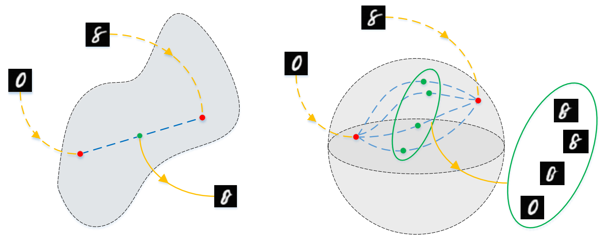
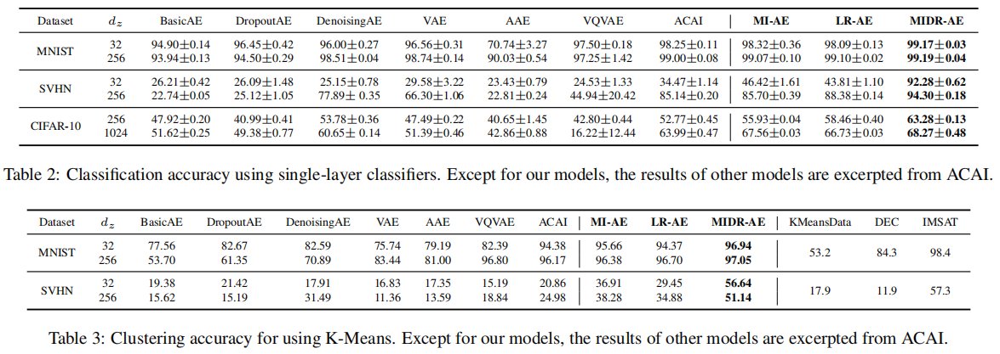
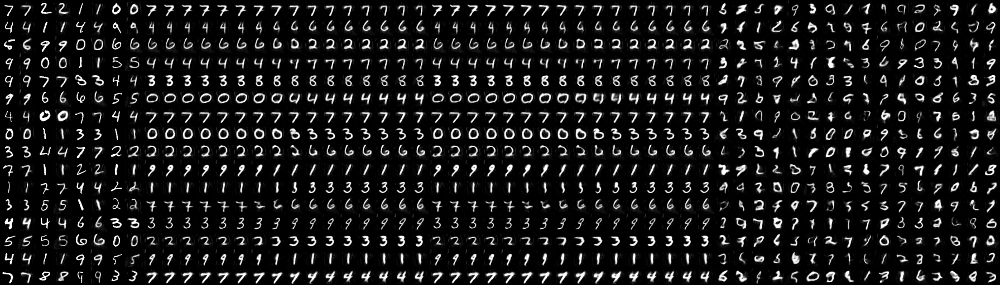

# MIDR-AE

MIDR-AE (right) introduces Multidimensional Interpolation and Dual Regularizations to improve latent representations in autoencoders. 

## Requirements
Before running MIDR-AE, you need python==3.5.6 and the following python packages:
- cudnn==7.1.2
- numpy==1.15.2
- scipy==1.1.0
- tensorflow==1.8.0

For your ease, my conda environment is exported as file. You can easily restore the environment by typing command: 

    conda env create -f environment.yaml

It would take you about 30 minutes to download all necessary python packages.

## Preparing datasets
Specify the directory for saving your datasets by: 

    export AE_DATA=./Data

All the downloaded dataset would be save in './Data'. 

Before running the model, you should prepare dataset by executing: 

    python create_datasets.py

It would take a long time. So I also upload all the necessary files to my **Baidu Cloud**, please download all the *.tfrecord and save in './Data'. 

## Running the code

There are multiple base models:

- Baseline
- Denoising
- Dropout
- Variational AE
- VQVAE
- Adversarial AE
- ACAI

Our proposed model are listed as follows:
- MI-AE
- LR-AE
- DR-ACAI
- MIDR-AE

Find *.sh in **runs** directory, we have all optimal hyperparameters for various models specified there. Just run:

    bash runs/miae.sh
    bash runs/lrae.sh
    bash runs/dr_acai.sh
    bash runs/midrae.sh

You should be able to achieve the reported accuracy of single-layer classifier and clustering resuls:

You can also check the model checkpoints and intermediate images in directory './TRAIN'. 

## Results
Some of the results of MIDR-AE are shown are follows:

MNIST-32:

SVHN-32:

Finally, if you have any questions about the code, please feel free to email: csliguanyue007@mail.scut.edu.cn
